Breast Cancer TCGA Analysis
================

# Dependencies

``` r
library(tidyverse)
```

    ## ── Attaching packages ───────────────────────────────────────────────────────────────────── tidyverse 1.2.1 ──

    ## ✔ ggplot2 2.2.1     ✔ purrr   0.2.4
    ## ✔ tibble  1.4.2     ✔ dplyr   0.7.4
    ## ✔ tidyr   0.8.0     ✔ stringr 1.3.0
    ## ✔ readr   1.1.1     ✔ forcats 0.3.0

    ## ── Conflicts ──────────────────────────────────────────────────────────────────────── tidyverse_conflicts() ──
    ## ✖ dplyr::filter() masks stats::filter()
    ## ✖ dplyr::lag()    masks stats::lag()

``` r
library(ggforce)
library(recount)
```

    ## Loading required package: SummarizedExperiment

    ## Loading required package: GenomicRanges

    ## Loading required package: stats4

    ## Loading required package: BiocGenerics

    ## Loading required package: parallel

    ## 
    ## Attaching package: 'BiocGenerics'

    ## The following objects are masked from 'package:parallel':
    ## 
    ##     clusterApply, clusterApplyLB, clusterCall, clusterEvalQ,
    ##     clusterExport, clusterMap, parApply, parCapply, parLapply,
    ##     parLapplyLB, parRapply, parSapply, parSapplyLB

    ## The following objects are masked from 'package:dplyr':
    ## 
    ##     combine, intersect, setdiff, union

    ## The following objects are masked from 'package:stats':
    ## 
    ##     IQR, mad, sd, var, xtabs

    ## The following objects are masked from 'package:base':
    ## 
    ##     anyDuplicated, append, as.data.frame, cbind, colMeans,
    ##     colnames, colSums, do.call, duplicated, eval, evalq, Filter,
    ##     Find, get, grep, grepl, intersect, is.unsorted, lapply,
    ##     lengths, Map, mapply, match, mget, order, paste, pmax,
    ##     pmax.int, pmin, pmin.int, Position, rank, rbind, Reduce,
    ##     rowMeans, rownames, rowSums, sapply, setdiff, sort, table,
    ##     tapply, union, unique, unsplit, which, which.max, which.min

    ## Loading required package: S4Vectors

    ## 
    ## Attaching package: 'S4Vectors'

    ## The following objects are masked from 'package:dplyr':
    ## 
    ##     first, rename

    ## The following object is masked from 'package:tidyr':
    ## 
    ##     expand

    ## The following object is masked from 'package:base':
    ## 
    ##     expand.grid

    ## Loading required package: IRanges

    ## 
    ## Attaching package: 'IRanges'

    ## The following objects are masked from 'package:dplyr':
    ## 
    ##     collapse, desc, slice

    ## The following object is masked from 'package:purrr':
    ## 
    ##     reduce

    ## Loading required package: GenomeInfoDb

    ## Loading required package: Biobase

    ## Welcome to Bioconductor
    ## 
    ##     Vignettes contain introductory material; view with
    ##     'browseVignettes()'. To cite Bioconductor, see
    ##     'citation("Biobase")', and for packages 'citation("pkgname")'.

    ## Loading required package: DelayedArray

    ## Loading required package: matrixStats

    ## 
    ## Attaching package: 'matrixStats'

    ## The following objects are masked from 'package:Biobase':
    ## 
    ##     anyMissing, rowMedians

    ## The following object is masked from 'package:dplyr':
    ## 
    ##     count

    ## 
    ## Attaching package: 'DelayedArray'

    ## The following objects are masked from 'package:matrixStats':
    ## 
    ##     colMaxs, colMins, colRanges, rowMaxs, rowMins, rowRanges

    ## The following object is masked from 'package:base':
    ## 
    ##     apply

    ## Setting options('download.file.method.GEOquery'='auto')

    ## Setting options('GEOquery.inmemory.gpl'=FALSE)

``` r
library(pheatmap)
library(viridis)
```

    ## Loading required package: viridisLite

``` r
library(useful)
library(RColorBrewer)
```

# Load the data

Gene-level expression data from the breast cancer TCGA cohort was
downloaded
[here](http://duffel.rail.bio/recount/TCGA/rse_gene_breast.Rdata). I’ll
work with a local copy here.

``` r
load("../data/rse_gene_breast.Rdata")
rse <- scale_counts(rse_gene, round=F)
exp <- assay(rse)
gene.data <- as.data.frame(rowData(rse))
```

# Grab expression values of gene set

We’re using a manually selected gene list to explore in the data. Kind
of an ugly way to grab a data frame of expression, but it works.

``` r
sox10 <- filter(gene.data, symbol=="SOX10")$gene_id
her2 <- filter(gene.data, symbol=="ERBB2")$gene_id
esr1 <- filter(gene.data, symbol=="ESR1")$gene_id
pgr <- filter(gene.data, symbol=="PGR")$gene_id
lcn2 <- filter(gene.data, symbol=="LCN2")$gene_id
ceacam1 <- filter(gene.data, symbol=="CEACAM1")$gene_id
l1cam <- filter(gene.data, symbol=="L1CAM")$gene_id
slk <- filter(gene.data, symbol=="SLK")$gene_id
sox8 <- filter(gene.data, symbol=="SOX8")$gene_id
sox9 <- filter(gene.data, symbol=="SOX9")$gene_id
ar <- filter(gene.data, symbol=="AR")$gene_id
pip <- filter(gene.data, symbol=="PIP")$gene_id

dat <- data.frame(sox10=exp[sox10,],
                  her2=exp[her2,],
                  esr1=exp[esr1,],
                  pgr=exp[pgr,],
                  lcn2=exp[lcn2,],
                  ceacam1=exp[ceacam1,],
                  l1cam = exp[l1cam,],
                  slk = exp[slk,],
                  sox8 = exp[sox8,],
                  sox9 = exp[sox9,],
                  ar = exp[ar,],
                  pip = exp[pip,]
                  )
```

This data frame will be used for plotting gene-gene expression plots.

# Identify molecular subtypes of samples

Breast cancer is often classified based on the expression of the hormone
receptors Her2 (ERBB2), Esr1, and Pr. We’ll cluster patients based on
their
expression.

``` r
dat.mat <- as.matrix(dat[,c(2,3,4)]) %>% log1p() %>% scale(scale=T, center=T)
dat.mat[dat.mat>=2] <- 2
dat.mat[dat.mat<=(-2)] <- -2
heatmap <- pheatmap(dat.mat, color=viridis(100),  scale="none", cluster_cols=F,
         cluster_rows=T, cutree_rows=3, show_rownames=F, clustering_method="ward.D2",
         file="../figs/receptor.heatmap.png",
         width=2.25, height=6)
plot(heatmap$gtable)
```

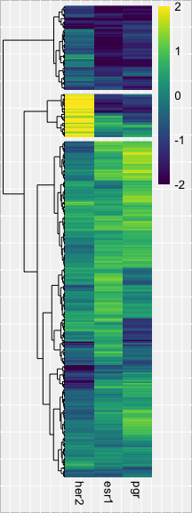<!-- -->

The patients seem to stratify nicely into triple-negative (TNBC), HER2+,
and luminal clusters.

## Get cluster IDs for each sample

We can retrieve the cluster ID from the heatmap object

``` r
clusters <- as.data.frame(cutree(heatmap$tree_row, k=3))
colnames(clusters) <- "Cluster"
clusters$sampleID <- rownames(clusters)
table(clusters$Cluster)
```

    ## 
    ##   1   2   3 
    ## 906 226 114

Kind of annoying that it isn’t clear which cluster is which, but based
on the size, it’s clear that Cluster 1 = Luminal, 2 = TNBC, 3 = HER2+

Let’s put this information into our data frame of expression values

``` r
dat$Cluster <- factor(clusters$Cluster, levels=c(2,3,1))
```

## Plot gene by cluster

``` r
colors <- brewer.pal(8, "Dark2")[c(3,2,1)]
```

Function to make life easier

``` r
plot_gene <- function(gene) {
  plot <- ggplot(dat, aes(x=Cluster, y=log2(dat[,gene] + 1))) +
    geom_sina(size=0.75, alpha=0.5, aes(colour=Cluster)) +
    stat_summary(fun.y=median, fun.ymin=median, fun.ymax=median,
                 geom='crossbar', width=0.5) +
    xlab('Cluster') + ylab('log2(Counts+1)') +
    scale_x_discrete(labels=c('TNBC', 'HER2+', 'Luminal A/B')) +
    scale_colour_manual(values=colors) +
    theme_classic() +
    theme(axis.text=element_text(size=10, color='black'),
          axis.title=element_text(size=12),
          legend.position='none')
  ggsave(plot, file=paste0('../figs/', gene, '.cluster.pdf'),
         width=3.25, height=2.9)
  plot
}
```

And actually running it

``` r
plot_gene('sox10')
```

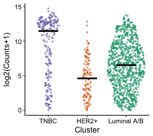<!-- -->

``` r
plot_gene('her2')
```

<!-- -->

``` r
plot_gene('esr1')
```

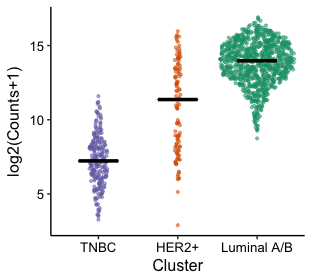<!-- -->

``` r
plot_gene('pgr')
```

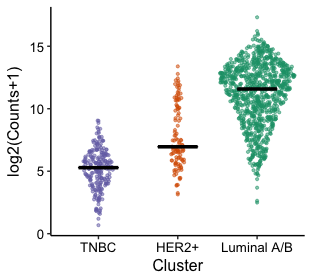<!-- -->

``` r
plot_gene('lcn2')
```

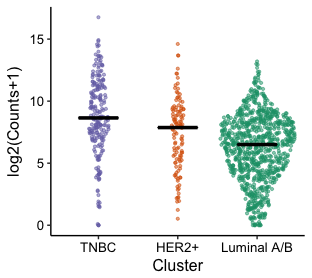<!-- -->

``` r
plot_gene('ceacam1')
```

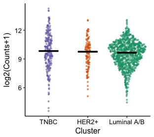<!-- -->

``` r
plot_gene('l1cam')
```

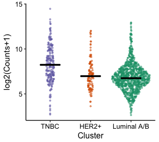<!-- -->

``` r
plot_gene('slk')
```

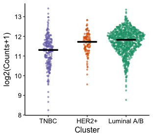<!-- -->

``` r
plot_gene('sox8')
```

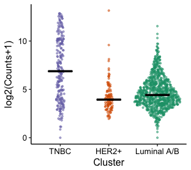<!-- -->

``` r
plot_gene('sox9')
```

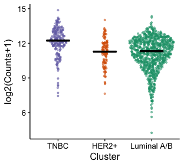<!-- -->

``` r
plot_gene('ar')
```

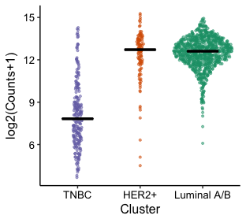<!-- -->

``` r
plot_gene('pip')
```

<!-- -->

## Heatmap with AR and SOX10 annotation

We want to demonstrate that Sox10 is a better subtype marker than
AR

``` r
row_annotation <- data.frame(AR = scale(log2(dat$ar + 1), scale=T, center=T),
                             SOX10 = scale(log2(dat$sox10 + 1), scale=T, center=T))
rownames(row_annotation) <- rownames(dat.mat)

row_annotation$AR[row_annotation$AR > 2] <- 2
row_annotation$AR[row_annotation$AR < (-2)] <- -2
row_annotation$SOX10[row_annotation$SOX10 > 2] <- 2
row_annotation$SOX10[row_annotation$SOX10 < (-2)] <- -2

ann_colors = list(
  AR = viridis(100),
  SOX10 = viridis(100))
```

``` r
heatmap <- pheatmap(dat.mat, color=viridis(100),  scale="none", cluster_cols=F,
         cluster_rows=T, cutree_rows=3, show_rownames=F, clustering_method="ward.D2",
         annotation_row = row_annotation, annotation_colors = ann_colors,
         annotation_legend=F,
         file="../figs/receptor.heatmap.with_Sox10_AR.png",
         width=2.75, height=6)
plot(heatmap$gtable)
```

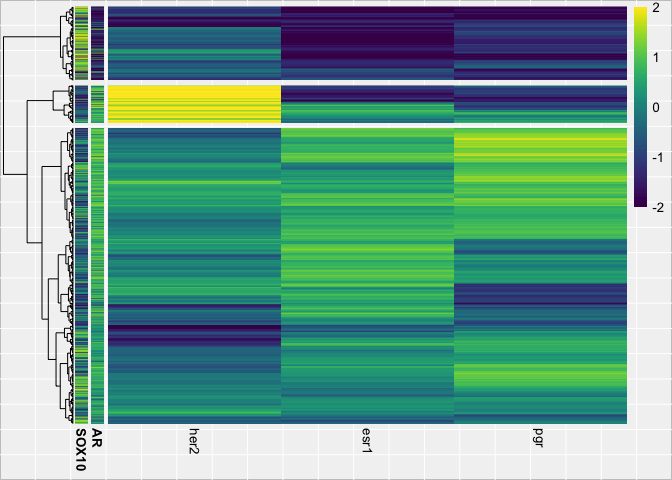<!-- -->

## Test to see if adding SOX10 to the clustering changes anything

``` r
ar_annotation <- data.frame(AR=row_annotation$AR)
rownames(ar_annotation) <- rownames(row_annotation)
ar_col <- list(AR = viridis(100))

dat.mat.2 <- cbind(dat.mat, scale(log2(dat$sox10 + 1), scale=T, center=T)) 
dat.mat.2[dat.mat.2>=2] <- 2
dat.mat.2[dat.mat.2<=(-2)] <- -2
colnames(dat.mat.2) <- c("HER2" ,"ESR1", "PGR", "SOX10")
heatmap <- pheatmap(dat.mat.2, color=viridis(100),  scale="none", cluster_cols=F,
         cluster_rows=T, cutree_rows=3, show_rownames=F, clustering_method="ward.D2",
         file="../figs/receptor.heatmap.clustered.with.sox10.png",
         annotation_row=ar_annotation, annotation_colors=ar_col, annotation_legend=F,
         width=2.75, height=6)
plot(heatmap$gtable)
```

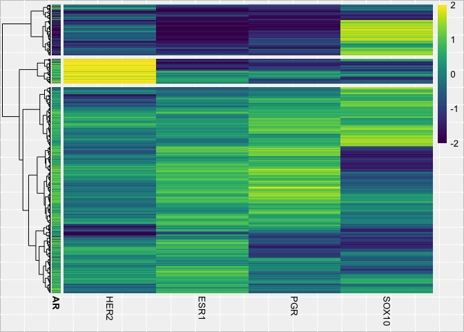<!-- -->

### How many patients fall in each subtype with/without sox10 in the classification

Before

``` r
table(clusters$Cluster)
```

    ## 
    ##   1   2   3 
    ## 906 226 114

After

``` r
table(cutree(heatmap$tree_row, k=3))
```

    ## 
    ##   1   2   3 
    ## 912 225 109

### How many patients fall in each subtype with/without sox10 in the classification

Before

``` r
table(clusters$Cluster)
```

    ## 
    ##   1   2   3 
    ## 906 226 114

After

``` r
table(cutree(heatmap$tree_row, k=3))
```

    ## 
    ##   1   2   3 
    ## 912 225 109

# Constructing a TNBC gene signature

We want to use an unbiased approach to see what genes are good markers
of each of the clusters we identified. We’ll just use an anova to look
for genes with differences across the groups.

## Construct models

``` r
run_anova <- function(x){
  model <- oneway.test(x~factor(clusters$Cluster))
  res <- data.frame(p.val = model$p.value,
                    f.stat = as.numeric(model$statistic))
  return(res)
}
```

Run the function down the matrix, collecting BH-corrected p-values for
each gene. First we’ll just log-transform the matrix so it’s more
normally distributed.

``` r
exp <- exp[rowSums(exp)!=0,] #remove zero variance rows
exp <- log2(exp+1)
```

Run the test

``` r
cluster.models <- apply(exp, 1, run_anova)
cluster.models <- do.call(rbind.data.frame, cluster.models)
cluster.models$gene_id <- rownames(cluster.models)
cluster.models <- left_join(cluster.models, gene.data, by="gene_id")
cluster.models$bp_length <- NULL
cluster.models$q.val <- p.adjust(cluster.models$p.val, method="BH")
cluster.models <- filter(cluster.models, symbol != "NA")
nrow(filter(cluster.models, q.val <= 0.01))
```

    ## [1] 18907

The joys of large sample sizes. We need an effect-size cutoff.

## Calculating effect size

I’ll calculate the average expression across clusters, and filter for
genes with a high fold change between the highest and lowest
values

``` r
exp <- exp[cluster.models$gene_id,] #to remove the few rows that have NA as gene
```

``` r
TNBC.samples <- filter(clusters, Cluster==2)$sampleID
HER2.samples <- filter(clusters, Cluster==3)$sampleID
Luminal.samples <- filter(clusters, Cluster==1)$sampleID
```

``` r
exp.averages <- data.frame(TNBC = rowMeans(exp[,TNBC.samples]),
                           HER2 = rowMeans(exp[,HER2.samples]),
                           Luminal = rowMeans(exp[,Luminal.samples]))
exp.averages <- as.matrix(exp.averages)
cluster.models$diff <- rowMaxs(exp.averages) - rowMins(exp.averages)
```

``` r
hist(cluster.models$diff, breaks=40, col="firebrick", pch=20,
     xlab="Exp. Difference", main="")
```

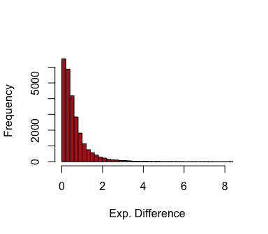<!-- -->

## Filtering by effect size

Cut off is really arbitrary here. We want to choose a cutoff that brings
the marker list down to something manageable. We’ll try markers

``` r
sig.markers <- filter(cluster.models, q.val <= 0.01, diff >= 4)
nrow(sig.markers)
```

    ## [1] 112

## Plotting marker genes

### Averages for each cluster

``` r
marker.heatmap <- pheatmap(exp.averages[sig.markers$gene_id,],
                    color=magma(100),
                    scale="row",
                    cluster_rows=T,
                    cluster_cols=F,
                    cutree_rows=4,
                    show_rownames=F,
                    clustering_method="ward.D2",
                    filename="../figs/marker.heatmap.png",
                    width=2, height=3.75)
plot(marker.heatmap$gtable)
```

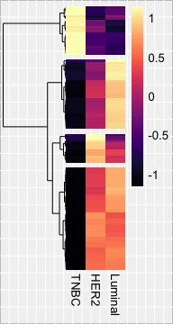<!-- -->

And just grab the cluster ID for each marker

``` r
gene.clusters <- as.data.frame(cutree(marker.heatmap$tree_row, k=4))
colnames(gene.clusters) <- "Cluster"
gene.clusters$gene_id <- rownames(gene.clusters)
gene.clusters <- left_join(gene.clusters, gene.data, by="gene_id")
gene.clusters$Cluster <- factor(gene.clusters$Cluster)
sig.markers$Cluster <- gene.clusters$Cluster
summary(gene.clusters$Cluster)
```

    ##  1  2  3  4 
    ## 46 22 31 13

Heatmap top to bottom: 2, 3, 4, 1

#### Where are specific markers?

We want to identify specifically where SOX10, AR, PGR, and HER2 are

``` r
heatmap.avg.order <- marker.heatmap$tree_row$order
length(heatmap.avg.order)
```

    ## [1] 112

##### SOX10

``` r
which(sig.markers$gene_id[heatmap.avg.order] == sox10)
```

    ## [1] 5

##### AR

``` r
which(sig.markers$gene_id[heatmap.avg.order] == ar)
```

    ## [1] 111

##### PGR

``` r
which(sig.markers$gene_id[heatmap.avg.order] == pgr)
```

    ## [1] 26

##### HER2

``` r
which(sig.markers$gene_id[heatmap.avg.order] == her2)
```

    ## [1] 55

### Across all samples

Getting the matrix ready

``` r
exp.markers <- exp[sig.markers$gene_id,]
exp.markers <- t(scale(t(exp.markers), scale=T, center=T))
exp.markers[exp.markers > 1.25] <- 1.25
exp.markers[exp.markers < (-1.25)] <- -1.25
```

I want to use the ordering of the original heatmap used to subtype each
sample. For the columns (genes), I’ll order the columns simply by
cluster ID, as ordered in the heatmap (ie. clusters 2, 3, 4,
1.

``` r
sig.markers <- arrange(sig.markers, desc(diff)) #intragroup order by diff
gene.order <- c(filter(sig.markers, Cluster == 2)$gene_id,
                filter(sig.markers, Cluster == 3)$gene_id,
                filter(sig.markers, Cluster == 4)$gene_id,
                filter(sig.markers, Cluster == 1)$gene_id)
sample.order <- heatmap$tree_row$order
```

Set up annotation\_row and annotation\_col for pheatmap to identify what
clusters things belong to

``` r
annotation_row <- clusters
annotation_row$sampleID <- NULL
annotation_row$Cluster[annotation_row$Cluster==2] = "TNBC"
annotation_row$Cluster[annotation_row$Cluster==3] = "HER2+"
annotation_row$Cluster[annotation_row$Cluster==1] = "Luminal A/B"

annotation_col <- data.frame(MarkerCluster = factor(gene.clusters$Cluster))
rownames(annotation_col) <- gene.clusters$gene_id
```

``` r
marker.exp.heatmap <- pheatmap(t(exp.markers[gene.order, sample.order]),
                               color=viridis(100),
                               cluster_rows=F,
                               cluster_cols=F,
                               scale="none",
                               show_rownames=F,
                               show_colnames=F,
                               annotation_col=annotation_col,
                               annotation_row=annotation_row,
                               filename="../figs/marker.heatmap.allsamples.png",
                               width=4, height=5)
plot(marker.exp.heatmap$gtable)
```

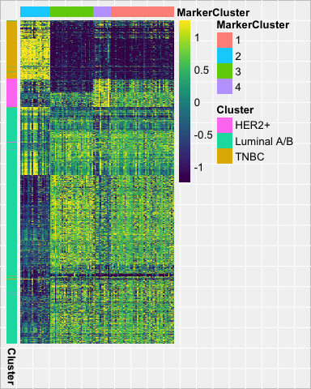<!-- -->

#### Where are specific markers in this heatmap

``` r
which(gene.order==sox10)
```

    ## [1] 10

``` r
which(gene.order==ar)
```

    ## [1] 100

``` r
which(gene.order==pgr)
```

    ## [1] 26

``` r
which(gene.order==her2)
```

    ## [1] 58

\#Gene-gene plots

The manuscript dives into androgen receptor (AR) expression patterns
across molecular subtypes. I just want to make some plots comparing AR
to other markers across each cluster. All this info is contained in the
‘dat’ data frame right
now

## AR vs. Markers of clusters

``` r
ar.sox10 <-  ggplot(dat, aes(x=log2(dat[,"ar"]+1), y=log2(dat[,"sox10"]+1))) +
  geom_point(size=1.5, alpha=0.5, aes(color=Cluster)) +
  geom_vline(xintercept=9, linetype="dashed") +
  geom_hline(yintercept=mean(log2(dat[,"sox10"] + 1)),
             linetype="dashed") +
  xlab("AR") + ylab("SOX10") +
  scale_colour_manual(values=colors[c(1,2,3)]) +
  scale_x_continuous(limits=c(3.65,15.5)) +
  scale_y_continuous(limits=c(0, max(log2(dat[,"sox10"]+1))+0.5)) +
  theme_classic() + 
  theme(axis.text=element_text(size=10, color='black'),
        axis.title=element_text(size=12))
ggsave(ar.sox10, file="../figs/ar.sox10.pdf", width=3.75, height=2.9)
ar.sox10
```

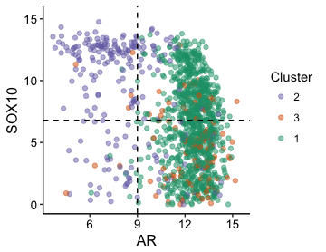<!-- -->

``` r
ar.her2 <-  ggplot(dat, aes(x=log2(dat[,"ar"]+1), y=log2(dat[,"her2"]+1))) +
  geom_point(size=1.5, alpha=0.5, aes(color=Cluster)) +
  geom_vline(xintercept=9, linetype="dashed") +
  geom_hline(yintercept=mean(log2(dat[,"her2"] + 1)),
             linetype="dashed") +
  xlab("AR") + ylab("HER2") +
  scale_colour_manual(values=colors[c(1,2,3)]) +
  scale_x_continuous(limits=c(3.65,15.5)) +
  scale_y_continuous(limits=c(0, max(log2(dat[,"her2"]+1))+0.5)) +
  theme_classic() + 
  theme(axis.text=element_text(size=10, color='black'),
        axis.title=element_text(size=12))
ggsave(ar.her2, file="../figs/ar.her2.pdf", width=3.75, height=2.9)
ar.her2
```

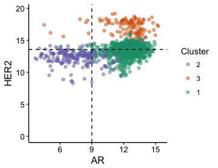<!-- -->

``` r
ar.pgr <-  ggplot(dat, aes(x=log2(dat[,"ar"]+1), y=log2(dat[,"pgr"]+1))) +
  geom_point(size=1.5, alpha=0.5, aes(color=Cluster)) +
  geom_vline(xintercept=9, linetype="dashed") +
  geom_hline(yintercept=mean(log2(dat[,"pgr"] + 1)),
             linetype="dashed") +
  xlab("AR") + ylab("PR") +
  scale_colour_manual(values=colors[c(1,2,3)]) +
  scale_x_continuous(limits=c(3.65,15.5)) +
  scale_y_continuous(limits=c(0, max(log2(dat[,"pgr"]+1))+0.5)) +
  theme_classic() + 
  theme(axis.text=element_text(size=10, color='black'),
        axis.title=element_text(size=12))
ggsave(ar.pgr, file="../figs/ar.pgr.pdf", width=3.75, height=2.9)
ar.pgr
```

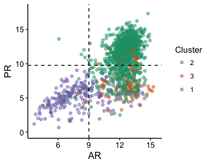<!-- -->

\#\#AR vs. Markers of clusters w/ subset

``` r
dat.tnbc <- filter(dat, Cluster==2)
ar.tnbc <- ggplot(dat.tnbc, 
                  aes(x=log2(dat.tnbc[,"ar"]+1), y=log2(dat.tnbc[,"sox10"]+1))) + 
  geom_point(size=1.5, alpha=0.75, colour=colors[1]) +
  geom_vline(xintercept=9, linetype="dashed") +
  geom_hline(yintercept=mean(log2(dat[,"sox10"] + 1)),
             linetype="dashed") +
  xlab("AR") + ylab("SOX10") +
  scale_x_continuous(limits=c(3.65,15.5)) +
  scale_y_continuous(limits=c(0, max(log2(dat[,"sox10"]+1))+0.5)) +
  theme_classic() + 
  theme(axis.text=element_text(size=10, color='black'),
        axis.title=element_text(size=12))
ggsave(ar.tnbc, file="../figs/ar.sox10.tnbc.pdf", width=3.25, height=2.9)

dat.her2 <- filter(dat, Cluster==3)
ar.her2 <- ggplot(dat.her2, 
                  aes(x=log2(dat.her2[,"ar"]+1), y=log2(dat.her2[,"her2"]+1))) +
  geom_point(size=1.5, alpha=0.75, colour=colors[2]) +
  geom_vline(xintercept=9, linetype="dashed") +
  geom_hline(yintercept=mean(log2(dat[,"her2"] + 1)),
             linetype="dashed") +
  xlab("AR") + ylab("HER2") +
  scale_x_continuous(limits=c(3.65,15.5)) +
  scale_y_continuous(limits=c(0, max(log2(dat[,"her2"]+1))+0.5)) +
  theme_classic() +
  theme(axis.text=element_text(size=10, color='black'),
        axis.title=element_text(size=12))
ggsave(ar.her2, file="../figs/ar.her2.her2.pdf", width=3.25, height=2.9)

dat.luminal <- filter(dat, Cluster==1)
ar.luminal <- ggplot(dat.luminal, 
                  aes(x=log2(dat.luminal[,"ar"]+1),
                      y=log2(dat.luminal[,"pgr"]+1))) +
  geom_point(size=1.5, alpha=0.75, colour=colors[3]) +
  geom_vline(xintercept=9, linetype="dashed") +
  geom_hline(yintercept=mean(log2(dat[,"pgr"] + 1)),
             linetype="dashed") +
  xlab("AR") + ylab("PR") +
  scale_x_continuous(limits=c(3.65,15.5)) +
  scale_y_continuous(limits=c(0, max(log2(dat[,"pgr"]+1))+0.5)) +
  theme_classic() +
  theme(axis.text=element_text(size=10, color='black'),
        axis.title=element_text(size=12))
ggsave(ar.luminal, file="../figs/ar.pr.luminal.pdf", width=3.25, height=2.9)

ar.tnbc
```

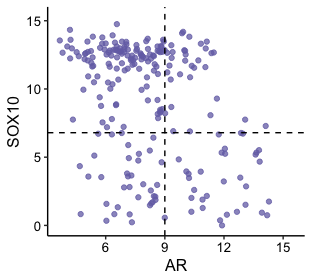<!-- -->

``` r
ar.her2
```

<!-- -->

``` r
ar.luminal
```

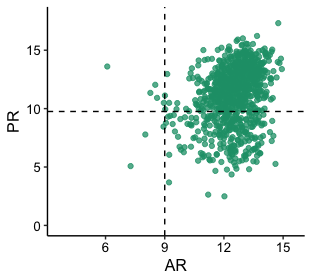<!-- -->

## Percentage of cells in “quadrants”

The paper discusses how genes that are highly expressed when AR is low
is indicative of TNBC. We define an arbitrary (based on density) gate of
AR expression at log2(counts+1)=9. The cutoff of the other markers is
defined as half of the max log2(counts+1) value.

### TNBC

``` r
#Top left
##Pass filter
nrow(filter(dat.tnbc, log2(ar + 1) < 9 & 
              log2(sox10 + 1) > mean(log2(dat[,"sox10"] + 1))))
```

    ## [1] 124

``` r
##Percentage
nrow(filter(dat.tnbc, log2(ar + 1) < 9 & 
              log2(sox10 + 1) > mean(log2(dat[,"sox10"] + 1)))) / nrow(dat.tnbc)
```

    ## [1] 0.5486726

``` r
#Top right
##Pass filter
nrow(filter(dat.tnbc, log2(ar + 1) > 9 & 
              log2(sox10 + 1) > mean(log2(dat[,"sox10"] + 1))))
```

    ## [1] 33

``` r
##Percentage
nrow(filter(dat.tnbc, log2(ar + 1) > 9 & 
              log2(sox10 + 1) > mean(log2(dat[,"sox10"] + 1)))) / nrow(dat.tnbc)
```

    ## [1] 0.1460177

``` r
#Bottom left
##Pass filter
nrow(filter(dat.tnbc, log2(ar + 1) < 9 & 
              log2(sox10 + 1) < mean(log2(dat[,"sox10"] + 1))))
```

    ## [1] 37

``` r
##Percentage
nrow(filter(dat.tnbc, log2(ar + 1) < 9 & 
              log2(sox10 + 1) < mean(log2(dat[,"sox10"] + 1)))) / nrow(dat.tnbc)
```

    ## [1] 0.1637168

``` r
#Bottom right
##Pass filter
nrow(filter(dat.tnbc, log2(ar + 1) > 9 & 
              log2(sox10 + 1) < mean(log2(dat[,"sox10"] + 1))))
```

    ## [1] 32

``` r
##Percentage
nrow(filter(dat.tnbc, log2(ar + 1) > 9 & 
              log2(sox10 + 1) < mean(log2(dat[,"sox10"] + 1)))) / nrow(dat.tnbc)
```

    ## [1] 0.1415929

### HER2

``` r
#Top left
##Pass filter
nrow(filter(dat.her2, log2(ar + 1) < 9 & 
              log2(her2 + 1) > mean(log2(dat[,"her2"] + 1))))
```

    ## [1] 7

``` r
##Percentage
nrow(filter(dat.tnbc, log2(ar + 1) < 9 & 
              log2(her2 + 1) > mean(log2(dat[,"her2"] + 1)))) / nrow(dat.her2)
```

    ## [1] 0.0877193

``` r
#Top right
##Pass filter
nrow(filter(dat.her2, log2(ar + 1) > 9 & 
              log2(her2 + 1) > mean(log2(dat[,"her2"] + 1))))
```

    ## [1] 107

``` r
##Percentage
nrow(filter(dat.her2, log2(ar + 1) > 9 & 
              log2(her2 + 1) > mean(log2(dat[,"her2"] + 1)))) / nrow(dat.her2)
```

    ## [1] 0.9385965

``` r
#Bottom left
##Pass filter
nrow(filter(dat.her2, log2(ar + 1) < 9 & 
              log2(her2 + 1) < mean(log2(dat[,"her2"] + 1))))
```

    ## [1] 0

``` r
##Percentage
nrow(filter(dat.her2, log2(ar + 1) < 9 & 
              log2(her2 + 1) < mean(log2(dat[,"her2"] + 1)))) / nrow(dat.her2)
```

    ## [1] 0

``` r
#Bottom right
##Pass filter
nrow(filter(dat.her2, log2(ar + 1) > 9 & 
              log2(her2 + 1) < mean(log2(dat[,"her2"] + 1))))
```

    ## [1] 0

``` r
##Percentage
nrow(filter(dat.her2, log2(ar + 1) > 9 & 
              log2(her2 + 1) < mean(log2(dat[,"her2"] + 1)))) / nrow(dat.her2)
```

    ## [1] 0

### Luminal

``` r
#Top left
##Pass filter
nrow(filter(dat.luminal, log2(ar + 1) < 9 & 
              log2(pgr + 1) > mean(log2(dat[,"pgr"] + 1))))
```

    ## [1] 5

``` r
##Percentage
nrow(filter(dat.luminal, log2(ar + 1) < 9 & 
              log2(pgr + 1) > mean(log2(dat[,"pgr"] + 1)))) / nrow(dat.luminal)
```

    ## [1] 0.005518764

``` r
#Top right
##Pass filter
nrow(filter(dat.luminal, log2(ar + 1) > 9 & 
              log2(pgr + 1) > mean(log2(dat[,"pgr"] + 1))))
```

    ## [1] 659

``` r
##Percentage
nrow(filter(dat.luminal, log2(ar + 1) > 9 & 
              log2(pgr + 1) > mean(log2(dat[,"pgr"] + 1)))) / nrow(dat.luminal)
```

    ## [1] 0.7273731

``` r
#Bottom left
##Pass filter
nrow(filter(dat.luminal, log2(ar + 1) < 9 & 
              log2(pgr + 1) < mean(log2(dat[,"pgr"] + 1))))
```

    ## [1] 3

``` r
##Percentage
nrow(filter(dat.her2, log2(ar + 1) < 9 & 
              log2(pgr + 1) < mean(log2(dat[,"pgr"] + 1)))) / nrow(dat.luminal)
```

    ## [1] 0.007726269

``` r
#Bottom right
##Pass filter
nrow(filter(dat.luminal, log2(ar + 1) > 9 & 
              log2(pgr + 1) < mean(log2(dat[,"pgr"] + 1))))
```

    ## [1] 239

``` r
##Percentage
nrow(filter(dat.luminal, log2(ar + 1) > 9 & 
              log2(pgr + 1) < mean(log2(dat[,"pgr"] + 1)))) / nrow(dat.luminal)
```

    ## [1] 0.2637969
